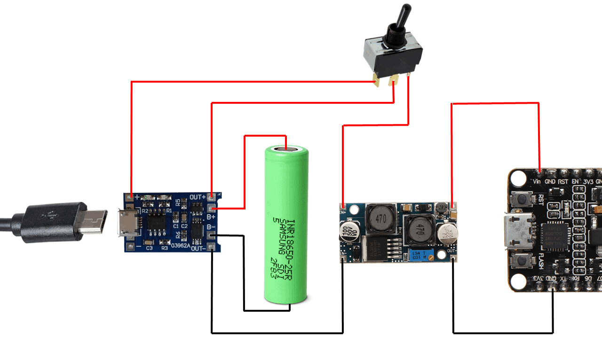

# ESP32-E-Ink-Picture-Frame
Collaboratory repository.

Idea reference:
https://www.hackster.io/lmarzen/esp32-e-paper-weather-display-a2f444

Guide to ESP32 low power-consumption:
https://diyi0t.com/reduce-the-esp32-power-consumption/

E-Ink proposal:
https://www.waveshare.com/7.3inch-e-Paper-HAT-F.htm

MicoSD Board proposal:
https://www.waveshare.com/product/modules/others/storage/micro-sd-storage-board.htm

https://emariete.com/en/co2-meter-with-battery-well-done/
